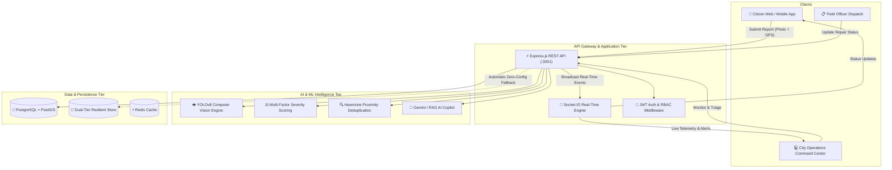

# 🏙️ CivicAI: AI-Powered Civic Issue Reporting & Urban Infrastructure Intelligence Platform

> *"See the Problem. Understand the Impact. Fix It Faster."*

[](https://gauravguptanoida19-bit.github.io/CivicAI/)
[](https://www.typescriptlang.org/)
[](https://reactjs.org/)
[](https://vitejs.dev/)
[](https://expressjs.com/)
[](https://socket.io/)
[](https://tailwindcss.com/)
[](LICENSE)

CivicAI is a production-grade, hackathon-ready smart city civic intelligence platform. It bridges citizens, municipal departments, and city leadership through AI-driven computer vision, automated multi-factor severity scoring, geospatial issue mapping, duplicate detection, and generative AI incident triage and reporting.

🌐 **Live Application**: [https://gauravguptanoida19-bit.github.io/CivicAI/](https://gauravguptanoida19-bit.github.io/CivicAI/)  
📂 **Repository**: [https://github.com/gauravguptanoida19-bit/CivicAI](https://github.com/gauravguptanoida19-bit/CivicAI)

The system features **zero-friction execution**: it boots immediately out of the box with realistic seed datasets (100 synthetic civic issues across 10 wards, 8 municipal departments, 4 RBAC users) and graceful in-memory resilient data stores if external databases or ML microservices are offline.

---

## 🏛️ System Architecture



---

## 🚀 Key Capabilities

1. **AI Computer Vision Detection**: Automatically detects and classifies civic infrastructure failures from photos (Potholes, Garbage Accumulation, Broken Streetlights, Open Manholes, Water Leakages, Drainage Blockages, Fallen Trees) with dynamic bounding box localization and confidence scoring.
2. **Multi-Factor Risk & Severity Engine**: Scores every issue from `0` to `100` based on Hazard Profile ($40\%$), Computer Vision Confidence ($25\%$), Corroborating Citizen Reports ($20\%$), and Transit Corridor Risk ($15\%$).
3. **Geospatial Intelligence & Leaflet Maps**: Interactive city maps with ward boundary indexing, custom color-coded category markers, and proximity filtering.
4. **Intelligent Deduplication**: Uses spatial radius clustering and visual similarity to detect and link duplicate complaints under a single master issue ticket.
5. **AI Incident Copilot (RAG)**: Conversational municipal assistant powered by Gemini API with clickable source citations referencing live incident database IDs.
6. **Real-Time Operational Sockets**: Broadcasts instant notifications (`issue:created`, `status:changed`, `alert:critical`) so administrative dashboards update without page refreshes.

---

## 🛠️ Technology Stack

| Layer | Technologies |
|---|---|
| **Frontend** | React 18, Vite, TypeScript, Tailwind CSS, Lucide React, Leaflet, React-Leaflet, Recharts, Framer Motion, Zustand, TanStack Query |
| **Backend** | Node.js, Express, TypeScript, Socket.IO, JWT, Multer, Winston, Argon2 / Crypto |
| **Data Layer** | Dual-Tier: PostgreSQL + PostGIS / In-Memory Resilient Store, Redis |
| **ML Service** | Python 3.10, FastAPI, YOLOv8, NumPy, Pillow, Uvicorn |
| **Generative AI** | Google Gemini API (`gemini-1.5-flash` / `gemini-3.8-flash`) / Heuristic RAG Fallback |
| **DevOps** | Docker, Docker Compose, Nginx |

---

## ⚡ Quickstart

### Prerequisites
- Node.js 18+ (Node 20 recommended)
- npm or yarn

### 1. Clone & Setup Environment
```bash
git clone https://github.com/gauravguptanoida19-bit/CivicAI.git
cd CivicAI
cp .env.example .env
```

### 2. Run Backend
```bash
cd backend
npm install
npm run dev
# Running on http://localhost:3001
```

### 3. Run Frontend
```bash
cd frontend
npm install
npm run dev
# Running on http://localhost:5173
```

### 4. Or 1-Click Launch (Windows / Linux)
```powershell
# Windows
.\scripts\dev.ps1

# Linux / macOS
chmod +x ./scripts/dev.sh
./scripts/dev.sh
```

---

## 🔐 1-Click Demo Accounts

All credentials work out of the box with the password `demo` (or any password in demo mode):

| Role | Name | Email | Password | Primary Access |
|---|---|---|---|---|
| **Citizen** | Aryan Sharma | `citizen@demo.civicai` | `demo` | Citizen Portal, Report Issue, My Reports, Map |
| **Security Analyst / Officer** | Priya Nair | `officer@demo.civicai` | `demo` | Officer Dispatch, Field Repair Queue, Status Updates |
| **Admin** | Raj Verma | `admin@demo.civicai` | `demo` | City Command Center, Analytics, AI Copilot, Wards, Users |
| **Supervisor** | Sunita Rao | `supervisor@demo.civicai` | `demo` | Department Oversight & Quality Assurance |

---

## 🎯 The 3-Minute Hackathon Demo Script

1. **Launch Landing Page**: Open `http://localhost:5173` to view the smart city overview, pipeline animation, and KPI counters.
2. **Citizen Issue Reporting**:
   - Log in as **Citizen** (`citizen@demo.civicai`).
   - Navigate to **Report Issue** (`/citizen/report`).
   - Upload a road pothole image and select GPS coordinates.
   - Click **Submit** — observe immediate real-time AI bounding box localization and severity score calculation.
3. **Admin Command Center**:
   - Switch session or log in as **Admin** (`admin@demo.civicai`).
   - Notice the new report appeared instantaneously via Socket.IO.
   - Open **Command Center** (`/admin/dashboard`) to inspect top KPIs, 7-day velocity charts, and ward distributions.
4. **Geospatial Map Inspection**:
   - Navigate to **Civic Map** (`/admin/map`).
   - View color-coded category markers across 10 municipal wards with cluster popups.
5. **AI Incident Copilot**:
   - Open **AI Copilot** (`/admin/ai-copilot`).
   - Ask: *"Show critical unresolved issues"* or *"Which ward has the highest pothole volume?"*.
   - Observe structured reasoning with clickable incident ticket citations.
6. **Analytics & Department Triage**:
   - Navigate to **Analytics** (`/admin/analytics`) and **Departments** (`/admin/departments`).
   - Reassign an issue to the Road Maintenance crew.

---

## 🧪 API Reference

- `GET /api/health` — System health and active database fallback status
- `POST /api/auth/login` — Authenticate and obtain JWT
- `POST /api/auth/register` — Create citizen or officer account
- `GET /api/issues` — Paginated issues list with multi-parameter filtering
- `POST /api/issues` — Multipart form upload and automated AI triage
- `POST /api/issues/analyze-image` — Test computer vision analysis on image without saving
- `PUT /api/issues/:id` — Update issue operational status
- `POST /api/issues/:id/assign` — Assign issue to department/officer
- `POST /api/ai/query` — RAG semantic query against municipal knowledge base
- `GET /api/analytics/summary` — High-level KPI counters
- `GET /api/analytics/trends` — Categorical breakdowns and resolution velocity

---

## 📄 License
This project is licensed under the MIT License - see the [LICENSE](LICENSE) file for details.
